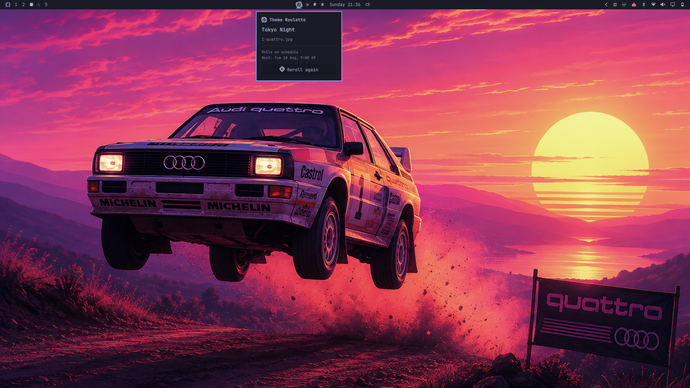
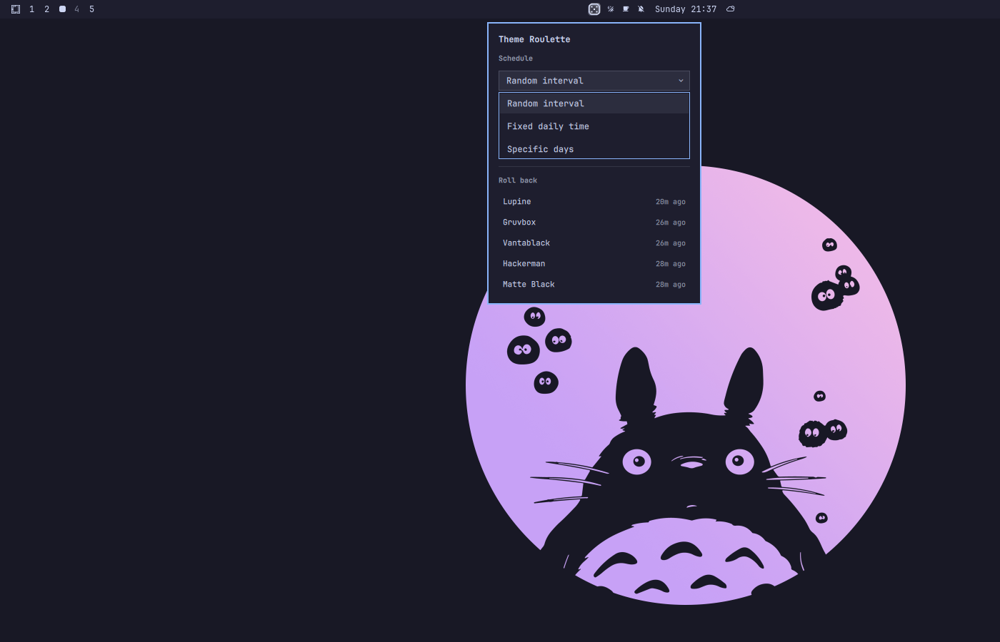
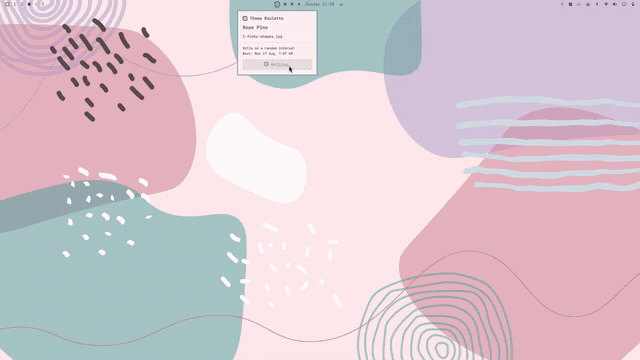
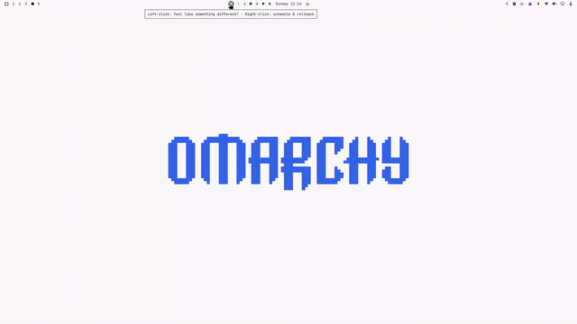

# Theme Roulette

An Omarchy Quickshell plugin that cycles your theme + wallpaper together on a
schedule, so you don't get stuck on one look. Bar button rerolls on demand;
right-click for schedule tweaks and rollback; a "Ready to roll?" prompt gives
you a beat to veto a scheduled roll before it lands.

## Demo

**A fresh roll** -- Tokyo Night landed, panel shows what changed and when
the next one's due, with a dice button to roll again right there.



**Right-click menu** -- schedule mode/params on the left, a rollback list of
recent picks on the right.



<table>
<tr>
<td width="50%">

**Rolling a new theme + wallpaper**


</td>
<td width="50%">

**Hover reveal + click actions**


</td>
</tr>
</table>

```
theme-roulette reroll | check-due | confirm-pending | skip-pending |
                recompute-next | history | restore <index> |
                config-set <json> | status | config
```

## What it does

- **Random interval**: reroll every `intervalMinHours`..`intervalMaxHours`,
  randomized within that range and re-randomized after every roll.
- **Fixed daily**: reroll once a day at `fixedTime`.
- **Specific days**: reroll at `fixedTime`, only on the weekdays in `days`.
- **Manual trigger**: left-click the dice bar icon ("feel like something
  different?") to reroll immediately, any time, independent of schedule.
- **Reroll again**: the popup that opens after a roll has its own dice
  button -- click it to roll again immediately if you don't like the result.
  It's the exact same action as the bar click, just fired again.
- **Right-click menu**: change the schedule mode/params on the fly, or roll
  back to any of the last few picks you rolled past and liked (`history` /
  `restore` -- see Architecture).
- **"Ready to roll?" prompt**: when a *scheduled* roll comes due, it doesn't
  apply silently -- a small non-blocking popup offers "Let it ride" (apply
  now) or "No, I'm feeling this" (skip this cycle, keep the current look,
  reschedule for next time). Left unanswered for `confirmTimeoutSeconds`
  (default 60s), it auto-resolves to "Let it ride" and applies on its own --
  so leaving the desktop mid-countdown still means a fresh theme is waiting
  on return, not a stuck prompt.
- Never repeats the theme or wallpaper that's currently applied. With
  `avoidRepeatWindow` set higher, it also avoids anything picked in the last
  N rolls (theme and wallpaper tracked independently), falling back to
  "avoid nothing" only if the exclusion would otherwise leave no candidates
  (e.g. you only have one theme installed).

**Heads up on wallpaper variety**: most Omarchy themes ship a branded
`omarchy.png`-style splash wallpaper alongside their own art, as one file in
the same pool everything else is picked from. On themes with a small total
background count (e.g. `catppuccin-latte`, `everforest`, and `kanagawa` only
ship 2 wallpapers each), that splash can end up as roughly 1-in-2 on every
roll of that theme -- not a bug in the picker (`shuf` is uniform, avoid-repeat
works correctly), just a side effect of a small pool. Themes with more
wallpapers (`tokyo-night`, `retro-82`, etc.) dilute it a lot more.

## How it actually changes your theme/wallpaper

Discovered on this machine via `omarchy theme --help` and reading
`/usr/share/omarchy/bin/omarchy-theme-{set,bg-set,bg-next,dir}` -- these are
real Omarchy commands, not invented:

- `omarchy theme set <kebab-name>` applies a theme (colors, hooks, restarts
  themed apps) and, as a side effect, auto-picks *a* background for it
  (deterministic "next in the list", not random).
- `omarchy theme bg set <path-to-image>` pins a specific wallpaper file.
  `theme-roulette` calls this right after `theme set` to override the
  auto-pick with its own random choice, so a "roll" is one deliberate
  theme+wallpaper pair rather than two independent coin flips.
- `omarchy theme dir <kebab-name>` resolves the directory holding a theme
  (preferring a user-installed copy over the built-in one), used to find
  that theme's `backgrounds/` folder.
- Installed themes are discovered the same way `omarchy theme list` does:
  directory names under `$OMARCHY_PATH/themes` and `~/.config/omarchy/themes`.
  Each theme's candidate wallpapers are its `backgrounds/` folder plus any
  extra images under `~/.config/omarchy/backgrounds/<theme>/` -- the same
  places `omarchy-theme-set`'s own background picker looks.

## Config

`~/.config/omarchy-theme-roulette/config.json` (hand-edit; there's no
settings UI yet). Created with these defaults on first run:

```json
{
  "mode": "random-interval",
  "intervalMinHours": 4,
  "intervalMaxHours": 12,
  "fixedTime": "9:00 AM",
  "days": ["mon", "tue", "wed", "thu", "fri", "sat", "sun"],
  "avoidRepeatWindow": 3,
  "confirmTimeoutSeconds": 60
}
```

| Field | Meaning |
|---|---|
| `mode` | `random-interval` \| `fixed-daily` \| `specific-days` |
| `intervalMinHours` / `intervalMaxHours` | Bounds for `random-interval`, in hours. |
| `fixedTime` | Time of day for `fixed-daily` / `specific-days`. Anything GNU `date -d` parses as a time works -- `"9:00 AM"` and `"21:00"` both fine. |
| `days` | Weekday list for `specific-days`: `mon`..`sun`. Ignored otherwise. |
| `avoidRepeatWindow` | Don't repeat a theme/wallpaper seen in the last N rolls. The immediately-previous pick is always avoided even if this is `0`. |
| `confirmTimeoutSeconds` | How long the "Ready to roll?" prompt waits before auto-resolving to "Let it ride". |

Editing this file by hand takes effect on the next Service.qml poll (~30s),
which reschedules `nextRollAt` from the new config without waiting out the
old schedule (run `theme-roulette recompute-next` for an instant effect).
The right-click menu's Schedule section does the same thing through
`theme-roulette config-set '<json-patch>'` -- a shallow merge onto this
file, e.g. `config-set '{"mode":"fixed-daily","fixedTime":"9:00 AM"}'`.

## Architecture

Same split as `omarchy-media-pip` / `omarchy-agent-butler`: `bin/theme-roulette`
is a plain CLI that owns every fact (current pick, pending pick, next roll
time, roll history) and writes `~/.local/state/omarchy-theme-roulette/state.json`;
`Service.qml` is a headless mirror of that file via `FileView`, plus a 30s
`Timer` that pokes `check-due` (a cheap no-op unless the scheduled time has
actually arrived *and* nothing is already pending). Neither QML file
computes a roll or a schedule -- everything the UI shows is read straight
off `state.json`.

Three surfaces hang off `BarWidget.qml`'s dice icon:

- **Left-click** fires an immediate `reroll` and opens `Panel.qml`, which
  shows the result and offers its own dice button to reroll again.
- **Right-click** toggles `RollMenu.qml`: schedule controls that write via
  `config-set`, and a rollback list built from `history`, applying a pick
  via `restore <index>` (which reapplies the theme/wallpaper without
  touching `history[]` or `nextRollAt` -- an explicit override, not a new
  roll).
- **`svc.pending`** (set by `check-due` when a scheduled roll lands)
  auto-opens `RollPrompt.qml`, a non-blocking "Ready to roll?" popup.
  "Let it ride" and "No, I'm feeling this" map to `confirm-pending` and
  `skip-pending`. If neither is clicked, `Service.qml`'s own 1s countdown
  Timer calls `confirm-pending` once `confirmTimeoutSeconds` elapses --
  the prompt resolves itself with nobody there to answer it.

`RollMenu.qml` and `RollPrompt.qml` wrap `qs.Ui.PopupCard` behind a plain
`Item` with ordinary (non-`required`) properties, the same way this
project's own `Panel.qml` wraps `KeyboardPanel` -- `PopupCard`'s own
`anchorItem`/`bar` are `required property`, which the `Binding` elements
`BarWidget.qml` uses to wire each popup up *after* its `Loader` resolves
can't satisfy directly (a `required property` must be set inline at the
point the object composing it is declared).

**Scheduling only progresses while `omarchy-shell` is running** (it's driven
by that Timer, not a separate systemd unit or standalone daemon) -- fine for
a desktop theming feature, since that's exactly while there's a desktop to
theme, but worth knowing: a roll due while logged out fires the moment the
shell starts back up, not at the scheduled instant.

**The CLI runs from a self-staged copy, not from inside the plugin
directory.** A companion binary launched via Quickshell's `Process` from
inside an *installed* plugin's own folder fails to start (a gotcha paid for
by `omarchy-media-pip`; see that project's `gotchas.md`/`CLAUDE.md` for the
elimination trail). `Service.qml` copies `bin/theme-roulette` to
`~/.local/state/omarchy-theme-roulette/.bin/theme-roulette` the moment it
knows its own install directory and always invokes that copy, re-staging on
every shell start so it can't go stale across a plugin update.

## Dependencies

`jq`, `shuf`, and GNU `date` (all present by default on Omarchy/Arch).
Everything else is a real `omarchy`/`omarchy-notification-send` command that
ships with the desktop -- no external services, no network access, nothing
that needs its own systemd unit.

## Files

- `manifest.json` -- schemaVersion 1, kinds `service` + `bar-widget`.
- `bin/theme-roulette` -- CLI: picking, scheduling, pending/confirm flow, history, applying, state I/O.
- `Service.qml` -- mirrors state.json/config.json, self-stages and polls the CLI, drives the pending countdown.
- `BarWidget.qml` -- dice bar icon; left-click rerolls, right-click opens the menu, hosts the prompt.
- `Panel.qml` -- shows the current roll; dice button to reroll again.
- `RollMenu.qml` -- right-click menu: schedule controls + rollback list.
- `RollPrompt.qml` -- "Ready to roll?" prompt for a pending scheduled roll.
- `install.sh` -- dev-loop install into `~/.config/omarchy/plugins/`.
